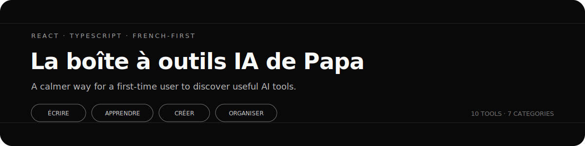
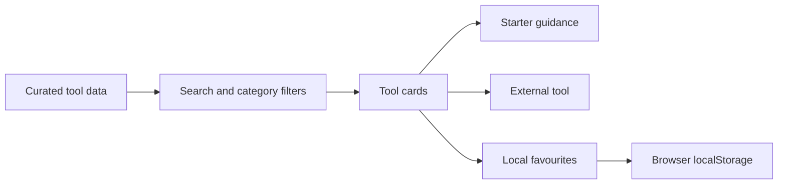

<p align="center">
  
</p>

<p align="center">
  <a href="https://github.com/MerveilleDivine/my-dads-app/actions/workflows/build.yml">
    
  </a>
</p>

# La boîte à outils IA de Papa

A French-first guide to useful AI tools, designed for someone who is curious about AI but does not want to navigate technical language, crowded directories, or vague product descriptions.

I built it for my father. The project started with a simple question: how do you introduce AI to someone without making them feel that they need to become technical first?

## The product idea

Most AI directories optimise for quantity. This one optimises for confidence.

Each tool explains:

- what it is useful for;
- how difficult it is to begin;
- whether French is supported;
- whether a free option exists;
- one prompt to try;
- one practical beginner tip;
- one caution to remember.

The result is not a catalogue of everything. It is a small, deliberately curated starting point.

## Current experience

| Area | Implementation |
|---|---|
| Language | French-first interface and guidance |
| Catalogue | 10 tools across 7 categories |
| Discovery | Accent-insensitive full-text search and category filters |
| Guidance | Expandable starter prompts, beginner tips, and cautions |
| Favourites | Stored locally in the browser |
| Safety | Simple privacy and verification guidance for first-time users |
| Layout | Responsive card interface built for mobile and desktop |
| Delivery | Client-side React application with automated lint and build checks |

## Product decisions

### Curation before scale

The data is intentionally local and reviewable. A smaller list makes it possible to explain every recommendation carefully rather than present hundreds of unexplained links.

### French by default

The interface, examples, labels, and guidance are written for a French-speaking user. Search normalisation also allows accented and unaccented text to match consistently.

### No account required

Favourites are stored with `localStorage`. The user gets a personal shortlist without creating an account or sending profile data to a server.

### Guidance inside the card

Each card keeps the learning context close to the tool: what to try, how to begin, and what to verify before relying on the result.

## How it works



The current version is entirely client-side. It does not use Node.js, Express, MongoDB, user accounts, or a remote application database.

## Features

- live search across names, descriptions, use cases, categories, prompts, and guidance;
- category filtering with a reset state;
- persistent favourites;
- separate shortlist for saved tools;
- expandable “how to begin” guidance;
- French and English capability labels;
- free-versus-paid indicators;
- no-results handling;
- responsive layouts from mobile to wide desktop;
- accessible labels and expanded-state attributes.

## Run locally

```bash
git clone https://github.com/MerveilleDivine/my-dads-app.git
cd my-dads-app

npm install
npm run dev
```

Open the local URL printed by Vite.

Create a production build with:

```bash
npm run build
```

Run the linter with:

```bash
npm run lint
```

## Repository map

```text
my-dads-app/
├── .github/workflows/build.yml
├── assets/readme-banner.svg
├── src/
│   ├── components/
│   │   ├── CategoryFilter.tsx
│   │   ├── Footer.tsx
│   │   ├── Navbar.tsx
│   │   ├── SearchBar.tsx
│   │   └── ToolCard.tsx
│   ├── data/tools.ts
│   ├── pages/Home.tsx
│   ├── App.tsx
│   └── index.css
├── package.json
└── README.md
```

| Part | Responsibility |
|---|---|
| `tools.ts` | Typed catalogue and beginner guidance |
| `Home.tsx` | Search, filters, favourites, and page composition |
| `ToolCard.tsx` | Tool details, starter guidance, and external navigation |
| `SearchBar.tsx` | Controlled search input |
| `CategoryFilter.tsx` | Horizontally scrollable category controls |

## Quality checks

The GitHub Actions workflow runs on pushes and pull requests to `main` using Node.js 22. It installs dependencies, runs ESLint, and produces the Vite build.

## Current scope and next work

This is a focused frontend product rather than a full-stack platform. The catalogue is maintained in code, favourites belong to one browser, and there is no analytics or remote synchronisation.

Useful next steps would be:

- add lightweight component tests;
- validate external links automatically;
- make the catalogue easier to update without editing source code;
- add optional sharing for a curated shortlist;
- document the product with real interface screenshots.

## Technology

`React 19` · `TypeScript` · `Vite 7` · `Tailwind CSS 4` · `React Router` · `GitHub Actions`

---

*It is a small gift of love, built with code.*
