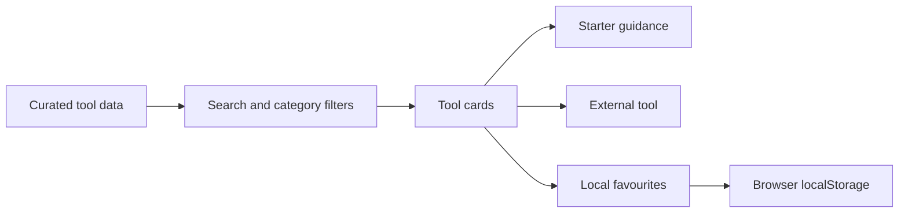

<p align="center">
  
</p>

<p align="center">
  <a href="https://github.com/MerveilleDivine/papa-ai-toolbox/actions/workflows/build.yml">
    
  </a>
</p>

# La boîte à outils IA de Papa

A French-first guide to useful AI tools, designed for someone who is curious about AI but does not want to navigate technical language, crowded directories, or vague product descriptions.

I built it for my father. The project started with a simple question: how do you introduce AI to someone without making them feel that they need to become technical first?

## The product idea

Most AI directories optimise for quantity. This one optimises for confidence.

Each tool explains:

- what it is useful for;
- how difficult it is to begin;
- whether French is supported;
- whether a free option exists;
- one prompt to try;
- one practical beginner tip;
- one caution to remember.

The result is not a catalogue of everything. It is a small, deliberately curated starting point.

## Current experience

| Area | Implementation |
|---|---|
| Language | French-first interface and guidance |
| Catalogue | 10 tools across 7 categories |
| Discovery | Accent-insensitive search, category filters, and shareable filter URLs |
| Guidance | Dedicated tool pages, expandable prompts, copy actions, tips, and cautions |
| Favourites | Validated local storage with a focused view and cross-tab synchronization |
| Safety | Simple privacy and verification guidance for first-time users |
| Layout | Responsive card interface built for mobile and desktop |
| Delivery | Client-side React application with automated lint, component tests, and build checks |

## Product decisions

### Curation before scale

The data is intentionally local and reviewable. A smaller list makes it possible to explain every recommendation carefully rather than present hundreds of unexplained links.

### French by default

The interface, examples, labels, and guidance are written for a French-speaking user. Search normalisation also allows accented and unaccented text to match consistently.

### No account required

Favourites are stored with `localStorage`. The user gets a personal shortlist without creating an account or sending profile data to a server. Stored values are validated, migrated from the original storage key, and synchronized across open tabs.

### Guidance inside the card

Each card keeps the learning context close to the tool: what to try, how to begin, and what to verify before relying on the result. Starter prompts can be copied directly, and every tool has a dedicated beginner-friendly detail page.

## How it works



The current version is entirely client-side. It does not use Node.js, Express, MongoDB, user accounts, or a remote application database.

## Features

- live search across names, descriptions, use cases, categories, prompts, and guidance;
- category filtering with a reset state;
- shareable URLs that preserve search, category, and favourite filters;
- persistent favourites;
- a focused view and separate shortlist for saved tools;
- expandable “how to begin” guidance;
- dedicated detail pages for every tool;
- one-click starter-prompt copying;
- French and English capability labels;
- free-versus-paid indicators;
- no-results handling;
- responsive layouts from mobile to wide desktop;
- accessible labels and expanded-state attributes.

## Run locally

```bash
git clone https://github.com/MerveilleDivine/papa-ai-toolbox.git
cd papa-ai-toolbox

npm install
npm run dev
```

Open the local URL printed by Vite.

Create a production build with:

```bash
npm run build
```

Run the linter with:

```bash
npm run lint
```

## Repository map

```text
papa-ai-toolbox/
├── .github/workflows/build.yml
├── assets/readme-banner.svg
├── src/
│   ├── components/
│   │   ├── CategoryFilter.tsx
│   │   ├── Footer.tsx
│   │   ├── Navbar.tsx
│   │   ├── PromptCopyButton.tsx
│   │   ├── SearchBar.tsx
│   │   └── ToolCard.tsx
│   ├── data/tools.ts
│   ├── hooks/useFavorites.ts
│   ├── lib/toolFilters.ts
│   ├── pages/Home.tsx
│   ├── pages/NotFound.tsx
│   ├── pages/ToolDetails.tsx
│   ├── test/setup.ts
│   ├── App.tsx
│   └── index.css
├── package-lock.json
├── package.json
└── README.md
```

| Part | Responsibility |
|---|---|
| `tools.ts` | Typed catalogue and beginner guidance |
| `Home.tsx` | Shareable search, filters, favourites, and page composition |
| `ToolCard.tsx` | Tool summary, starter guidance, prompt copying, and navigation |
| `ToolDetails.tsx` | Complete beginner guide and recovery for unknown tool URLs |
| `useFavorites.ts` | Validated persistence, migration, toggling, and tab synchronization |
| `toolFilters.ts` | Accent-insensitive search and composable filtering |
| `SearchBar.tsx` | Controlled search input |
| `CategoryFilter.tsx` | Horizontally scrollable category controls |

## Quality checks

Run the complete local check:

```bash
npm run lint
npm test
npm run build
```

The test suite covers filtering, accent normalization, favourite persistence, prompt copying, shareable URL state, card interactions, and tool detail routes.

The GitHub Actions workflow runs on pushes and pull requests to `main` using Node.js 22. It performs a reproducible `npm ci` install, then runs ESLint, 10 Vitest tests, TypeScript, and the Vite production build.

## Current scope and next work

This is a focused frontend product rather than a full-stack platform. The catalogue is maintained in code, favourites belong to one browser, and there is no account system or remote synchronization.

Useful next steps would be:

- validate external links automatically;
- make the catalogue easier to update without editing source code;
- add optional sharing for a curated shortlist;
- add end-to-end browser coverage;
- document the product with real interface screenshots.

## Technology

`React 19` · `TypeScript` · `Vite 7` · `Tailwind CSS 4` · `React Router` · `Vitest` · `Testing Library` · `GitHub Actions`

---

*It is a small gift of love, built with code.*
